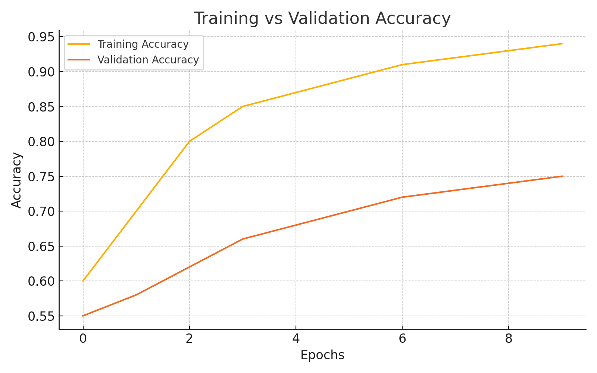

# Machine Learning Portfolio

This repository packages my machine learning coursework into a cleaner portfolio format, with the distracted driver detection project featured first and supporting class projects organized as additional work.

## Featured Project: Distracted Driver Detection

This project explores how neural networks can classify distracted driving behavior from image data. The work moves from data exploration to baseline neural networks, then to CNNs and transfer learning to improve performance and generalization.

### Highlights

- Built image classification workflows in Python using TensorFlow/Keras, NumPy, pandas, and Matplotlib.
- Compared MLP, CNN, and transfer learning approaches on the same distracted driving problem.
- Included evaluation work such as accuracy tracking, confusion-matrix style analysis, and saliency-based model inspection.
- Organized the project into notebook stages so the modeling process is easy to follow.

### Model Performance Summary

| Model | Train Accuracy | Validation Accuracy | Notes |
| --- | --- | --- | --- |
| MLP (2-layer) | ~97% | ~32% | Strong overfitting |
| CNN (3-layer) | ~96% | ~39% | Better generalization than MLP |
| VGG16 Transfer Learning | ~98% | ~80-85% | Best overall performance |

### Featured Notebooks

1. `notebooks/05_distracted_driver_data_exploration.ipynb`
2. `notebooks/06_distracted_driver_neural_networks.ipynb`
3. `notebooks/07_distracted_driver_saliency_and_evaluation.ipynb`

### Included Project Assets

- `data/metadata.csv`
- `data/image_data.npy`
- `model_weights/model.h5`
- `plots/accuracy_plot.png`
- `utils/data_utils.py`



## Other Stuff

These notebooks come from class projects and are included as supporting portfolio work. I cleaned the exports, renamed the files, and grouped them so the repo is easier to review.

- `notebooks/01_breast_cancer_logistic_regression.ipynb`: Classical machine learning classification with logistic regression.
- `notebooks/02_yelp_review_sentiment_classification.ipynb`: NLP sentiment classification using text preprocessing and scikit-learn.
- `notebooks/03_conscientious_cars_knn_neural_networks.ipynb`: Computer vision project comparing KNN-style and neural network approaches.
- `notebooks/04_conscientious_cars_cnn.ipynb`: CNN-based image classification follow-up for the Conscientious Cars dataset.

## Archive

The `archive/` folder keeps notebooks that are useful for reference but are not the main portfolio pieces:

- `archive/yelp_review_sentiment_solution_reference.ipynb`
- `archive/rock_paper_scissors_teachable_machine.ipynb`
- `archive/original_exports/`: Original notebook export names preserved from the earlier repo version.

## Project Structure

```text
.
|-- README.md
|-- requirements.txt
|-- notebooks/
|-- archive/
|-- docs/
|-- data/
|-- model_weights/
|-- plots/
`-- utils/
```

## Tech Stack

- Python
- TensorFlow / Keras
- scikit-learn
- NumPy
- pandas
- Matplotlib
- Seaborn
- OpenCV
- NLTK
- spaCy

## Getting Started

1. Install dependencies with `pip install -r requirements.txt`.
2. Open the notebooks in Jupyter or Google Colab.
3. Start with the distracted driver notebooks if you want the main project first.
4. Use the archived notebooks only as supporting reference material.

## Notes

- `docs/CLEANUP_MANIFEST.md` documents the cleanup decisions used to organize the portfolio files.
- Some notebooks were originally created in Google Colab, so local execution may require the listed Python packages and access to the expected dataset files.

## Author

Amrit Ladhar  
GitHub: [ALadhar](https://github.com/ALadhar)
